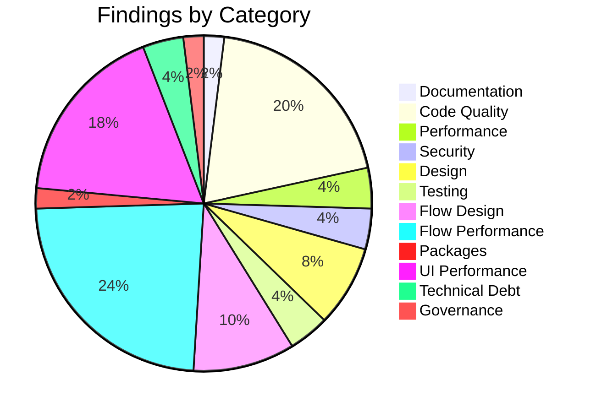

# Executive Summary - Salesforce Org Audit

**Org Name:** TWC Financial Services
**Audit Date:** 2026-02-10
**Org Type:** Sandbox

---

## Health Score

```
Health Score: 63/100
```

🟡 **Needs Improvement** - Several areas require attention

---

## Findings Overview

| Severity | Count | Percentage |
|----------|-------|------------|
| 🔴 Critical | 5 | 10% |
| 🟠 High | 16 | 31% |
| 🟡 Medium | 29 | 57% |
| 🟢 Low | 0 | 0% |
| ℹ️ Info | 1 | 2% |
| **Total** | **51** | 100% |

---

## Findings by Category



| Category | Count |
|----------|-------|
| Flow Performance | 12 |
| Code Quality | 10 |
| UI Performance | 9 |
| Flow Design | 5 |
| Design | 4 |
| Performance | 2 |
| Security | 2 |
| Testing | 2 |
| Technical Debt | 2 |
| Documentation | 1 |
| Packages | 1 |
| Governance | 1 |

---

## Key Risks (Critical Findings)

- **LocalVariableNamingConventions violations found (300 occurrences)**: Code quality and maintainability impact
- **FieldNamingConventions violations found (209 occurrences)**: Code quality and maintainability impact
- **MethodNamingConventions violations found (105 occurrences)**: Code quality and maintainability impact
- **FormalParameterNamingConventions violations found (48 occurrences)**: Code quality and maintainability impact
- **ClassNamingConventions violations found (39 occurrences)**: Code quality and maintainability impact

---

## Priority Actions (Top 5)

1. **LocalVariableNamingConventions violations found (300 occurrences)** (Critical)
2. **FieldNamingConventions violations found (209 occurrences)** (Critical)
3. **MethodNamingConventions violations found (105 occurrences)** (Critical)
4. **FormalParameterNamingConventions violations found (48 occurrences)** (Critical)
5. **ClassNamingConventions violations found (39 occurrences)** (Critical)

---

## Quick Wins

1 findings can be resolved with minimal effort:

- 197 unused Permission Sets detected (Medium)

---

## Storage & Limits Summary

| Resource | Used | Max | Usage |
|----------|------|-----|-------|
| Data Storage | 105 MB | 200 MB | 52.5% |
| File Storage | 116 MB | 200 MB | 58.0% |

---

## Effort Distribution

| Effort Level | Count | Percentage |
|--------------|-------|------------|
| Quick Win | 1 | 2% |
| Medium | 34 | 67% |
| High | 15 | 29% |

---

## Key Metrics Analyzed

| Metric | Count |
|--------|-------|
| Custom Apex Classes | 192 |
| Apex Triggers | 10 |
| Active Flows | 66 |
| LWC Components | 12 |
| Installed Packages | 26 |
| Named Credentials | 10 |
| Active Users | 53 |
| PMD Violations | 3,053 |

---

## Installed Packages Summary

**Total Packages:** 26

| Vendor | Count |
|--------|-------|
| nCino | 23 |
| nCino/DocuSign | 1 |
| Salesforce | 1 |
| Unknown | 1 |

- **Automated Spreading** (ncinoocr) v1.1908.0
- **Automatic Upgrades** (nPUSH) v1.1.0
- **Banking Advisor** (nCinoCB) v4.66.0
- **Matrix Manager** (matrix_manager) v1.175.0
- **nCino Bank Operating System** (nCino) v1.1735.1
- **nCino Benchmarking & Analytics** (nDX) v1.12.0
- **nCino Business Intelligence (Analytics)** (nBIDCA) v1.20.0
- **nCino Business Intelligence (Child)** (nBIDC) v1.6.0
- **nCino Cloud Banking Apex SDK** (nCinoCB) v1.26.0
- **nCino Cloud Banking Web Component SDK** (nCinoCB) v10.3.0

---

## Architecture Patterns Detected

- **Trigger Framework:** Trigger Handler Pattern
- **Selector Pattern:** Yes
- **Service Pattern:** Yes
- **Test Data Factory:** Yes

---

## Analysis Tools Used

| Tool | Purpose |
|------|---------|
| PMD Apex | Static code analysis for Apex |
| Custom Flow Analyzer | Flow complexity and patterns |
| Framework Analyzer | Trigger frameworks and design patterns |
| SOQL Queries | Security and permissions analysis |
| REST API | Org limits extraction |

---

## Recommendations Summary

1. **Immediate (Critical):** Address 5 critical findings immediately
2. **Short-term (High):** Plan remediation for 16 high-priority items
3. **Medium-term (Medium):** Schedule 29 medium-priority improvements
4. **Long-term (Low):** Consider 0 low-priority enhancements

---

## Next Steps

1. Review detailed findings in `docs/data/all-findings.json`
2. Prioritize remediation based on business impact
3. Create remediation backlog/tickets
4. Schedule follow-up audit in 3-6 months

---

*Report generated with Claude Code Audit Framework*
